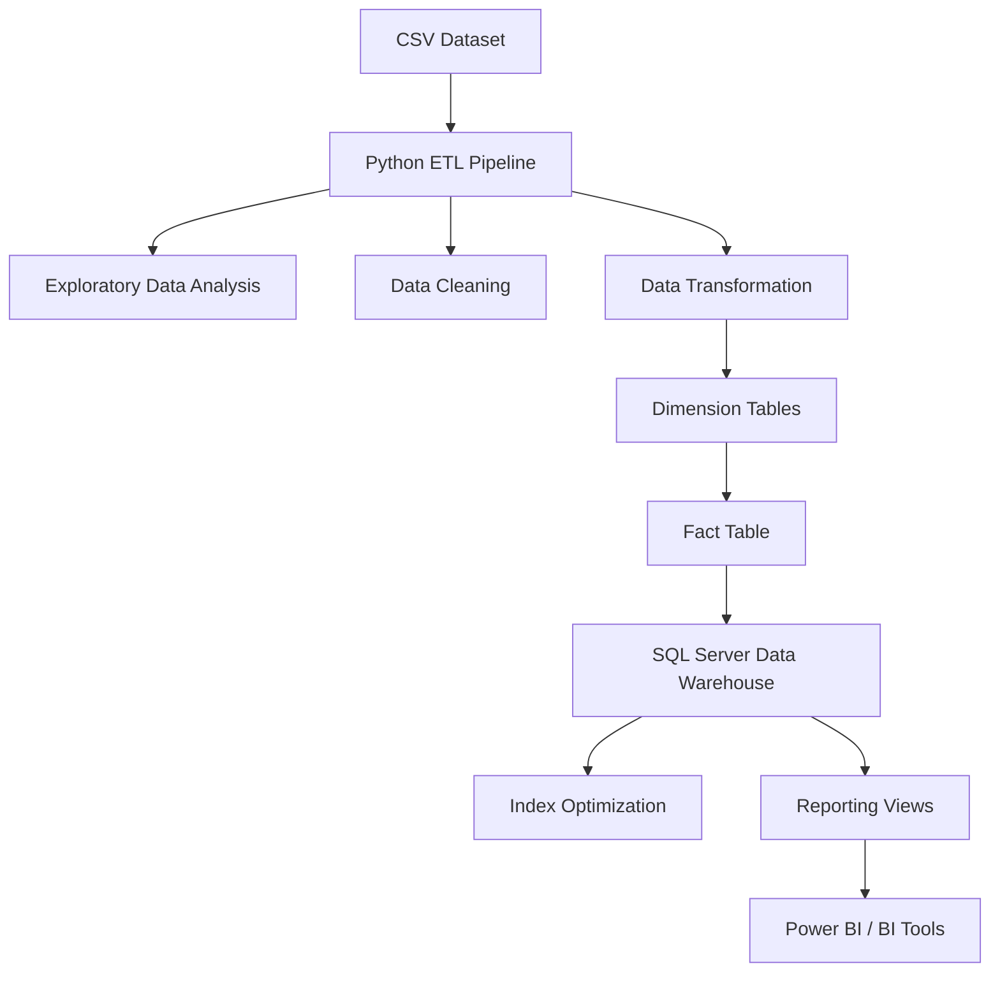
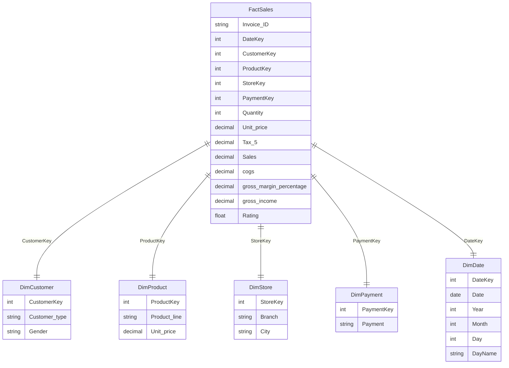

# Retail Sales Data Warehouse & ETL Pipeline

End-to-end **Data Engineering project** demonstrating:

- Python ETL pipeline
- Data cleaning & transformation
- Dimensional modeling (Star Schema)
- SQL Data Warehouse design
- Query optimization with indexes
- Reporting layer for BI tools

---

## Project Architecture



---

## Dataset

This project uses the [Supermarket Sales dataset](https://www.kaggle.com/datasets/faresashraf1001/supermarket-sales), which contains transactional retail data including:

- Customer information
- Product categories
- Store locations
- Payment methods
- Sales metrics

Each row represents a single sales transaction.

---

## ETL Pipeline

The ETL pipeline was implemented using Python and Pandas.

### Libraries

```python
import pandas as pd
import pyodbc
from sqlalchemy import create_engine
```

### Extract

Load dataset from CSV:

```python
df = pd.read_csv('../data/supermarket_sales.csv')
df.head()
```

### Exploratory Data Analysis

Basic inspection of the dataset:

```python
df.info()
df.describe()
df.isnull().sum()
```

### Data Cleaning

Cleaning steps included:

- Standardizing column names by removing spaces
- Converting date columns to datetime format
- Removing duplicate records
- Verifying correct data types

```python
df.columns = df.columns.str.replace(' ', '_')
df['Date'] = pd.to_datetime(df['Date'])
df = df.drop_duplicates()
```

### Transformation

Data was transformed into a Star Schema suitable for analytical workloads.

**Customer Dimension**
```python
dim_customer = df[['Customer_type','Gender']].drop_duplicates()
dim_customer.reset_index(drop=True, inplace=True)
dim_customer['CustomerKey'] = dim_customer.index + 1
```

**Store Dimension**
```python
dim_store = df[['Branch','City']].drop_duplicates()
dim_store.reset_index(drop=True, inplace=True)
dim_store['StoreKey'] = dim_store.index + 1
```

**Product Dimension**
```python
dim_product = df[['Product_line','Unit_price']].drop_duplicates()
dim_product.reset_index(drop=True, inplace=True)
dim_product['ProductKey'] = dim_product.index + 1
```

**Payment Dimension**
```python
dim_payment = df[['Payment']].drop_duplicates()
dim_payment.reset_index(drop=True, inplace=True)
dim_payment['PaymentKey'] = dim_payment.index + 1
```

**Date Dimension**
```python
dim_date = pd.DataFrame()
dim_date['Date'] = df['Date'].drop_duplicates().reset_index(drop=True)
dim_date['DateKey'] = dim_date['Date'].dt.strftime('%Y%m%d').astype(int)
dim_date['Year'] = dim_date['Date'].dt.year
dim_date['Month'] = dim_date['Date'].dt.month
dim_date['Day'] = dim_date['Date'].dt.day
dim_date['DayName'] = dim_date['Date'].dt.day_name()
dim_date = dim_date[['DateKey','Date','Year','Month','Day','DayName']]
```

**Fact Table**
```python
fact = df.merge(dim_store, on=['Branch','City'])
fact = fact.merge(dim_customer, on=['Customer_type','Gender'])
fact = fact.merge(dim_payment, on='Payment')
fact = fact.merge(dim_product, on=['Product_line','Unit_price'])
fact = fact.merge(dim_date[['Date','DateKey']], on='Date')

fact_sales = fact[[
    'Invoice_ID', 'DateKey', 'CustomerKey', 'ProductKey',
    'StoreKey', 'PaymentKey', 'Quantity', 'Unit_price',
    'Tax_5%', 'Sales', 'cogs', 'gross_margin_percentage',
    'gross_income', 'Rating'
]].copy()
```

---

## Data Warehouse Model



---

## SQL Warehouse Implementation

### Create Database & Tables

```sql
CREATE DATABASE RetailDW;
USE RetailDW;
GO

-- DimCustomer
CREATE TABLE DimCustomer (
    CustomerKey   INT PRIMARY KEY,
    Customer_type VARCHAR(50),
    Gender        VARCHAR(10)
);

-- DimStore
CREATE TABLE DimStore (
    StoreKey INT PRIMARY KEY,
    Branch   VARCHAR(50),
    City     VARCHAR(50)
);

-- DimPayment
CREATE TABLE DimPayment (
    PaymentKey INT PRIMARY KEY,
    Payment    VARCHAR(50)
);

-- DimProduct
CREATE TABLE DimProduct (
    ProductKey   INT PRIMARY KEY,
    Product_line VARCHAR(50),
    Unit_price   DECIMAL(10,2)
);

-- DimDate
CREATE TABLE DimDate (
    DateKey INT PRIMARY KEY,
    Date    DATE,
    Year    INT,
    Month   INT,
    Day     INT,
    DayName VARCHAR(20)
);

-- FactSales
CREATE TABLE FactSales (
    Invoice_ID              VARCHAR(20),
    DateKey                 INT,
    CustomerKey             INT,
    ProductKey              INT,
    StoreKey                INT,
    PaymentKey              INT,
    Quantity                INT,
    Unit_price              DECIMAL(10,2),
    [Tax_5%]                DECIMAL(10,2),
    Sales                   DECIMAL(10,2),
    cogs                    DECIMAL(10,2),
    gross_margin_percentage DECIMAL(5,2),
    gross_income            DECIMAL(10,2),
    Rating                  FLOAT,
    FOREIGN KEY (CustomerKey) REFERENCES DimCustomer(CustomerKey),
    FOREIGN KEY (ProductKey)  REFERENCES DimProduct(ProductKey),
    FOREIGN KEY (StoreKey)    REFERENCES DimStore(StoreKey),
    FOREIGN KEY (PaymentKey)  REFERENCES DimPayment(PaymentKey),
    FOREIGN KEY (DateKey)     REFERENCES DimDate(DateKey)
);
```

### Load Data

Data is loaded from Python using SQLAlchemy:

```python
engine = create_engine(
    "mssql+pyodbc://@localhost/RetailDW?driver=ODBC+Driver+17+for+SQL+Server&trusted_connection=yes"
)

dim_customer.to_sql('DimCustomer', engine, if_exists='append', index=False)
dim_store.to_sql('DimStore',       engine, if_exists='append', index=False)
dim_payment.to_sql('DimPayment',   engine, if_exists='append', index=False)
dim_product.to_sql('DimProduct',   engine, if_exists='append', index=False)
dim_date.to_sql('DimDate',         engine, if_exists='append', index=False)

fact_sales.to_sql('FactSales', engine, if_exists='append', index=False, chunksize=1000)
```

---

## SQL Performance Optimization

Indexes were created on high-frequency join keys to improve query performance:

```sql
USE RetailDW;
GO

CREATE INDEX IX_FactSales_DateKey
ON FactSales(DateKey);

CREATE INDEX IX_FactSales_ProductKey
ON FactSales(ProductKey);
```

---

## Reporting Views

### Sales Analysis View

```sql
USE RetailDW;
GO

CREATE OR ALTER VIEW vw_SalesAnalysis AS
SELECT
    d.Year,
    d.Month,
    p.Product_line,
    s.City,
    SUM(f.Sales)    AS Revenue,
    SUM(f.Quantity) AS Quantity
FROM FactSales f
JOIN DimDate    d ON f.DateKey    = d.DateKey
JOIN DimProduct p ON f.ProductKey = p.ProductKey
JOIN DimStore   s ON f.StoreKey   = s.StoreKey
GROUP BY
    d.Year,
    d.Month,
    p.Product_line,
    s.City;
```

### Product Performance View

```sql
CREATE OR ALTER VIEW vw_ProductPerformance AS
SELECT
    p.Product_line,
    SUM(f.Sales)    AS Revenue,
    SUM(f.Quantity) AS UnitsSold,
    AVG(f.Rating)   AS AvgRating
FROM FactSales f
JOIN DimProduct p ON f.ProductKey = p.ProductKey
GROUP BY p.Product_line;
```

---

## Technologies Used

| Category | Tools |
|---|---|
| Language | Python |
| Libraries | Pandas |
| Database | SQL Server |
| Connectors | pyodbc, SQLAlchemy |
| Modeling | Dimensional Modeling / Star Schema |

---

## Repository Structure

```
retail-sales-etl-pipeline/
│
├── data/
│   └── supermarket_sales.csv
│
├── notebooks/
│   └── retail_sales_etl.ipynb
│
├── sql/
│   ├── create_tables.sql
│   ├── indexes.sql
│   └── views.sql
│
└── README.md
```

---

## Skills Demonstrated

- Data Engineering
- ETL Development
- Data Cleaning & Transformation
- Data Warehousing
- Star Schema Modeling
- SQL Optimization
- BI Data Modeling

---

## Author

Omar Adel Farahat
