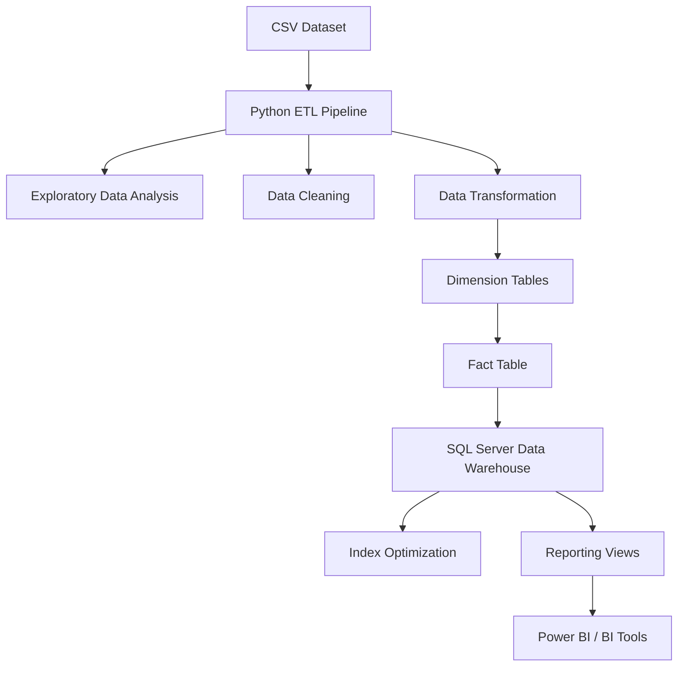
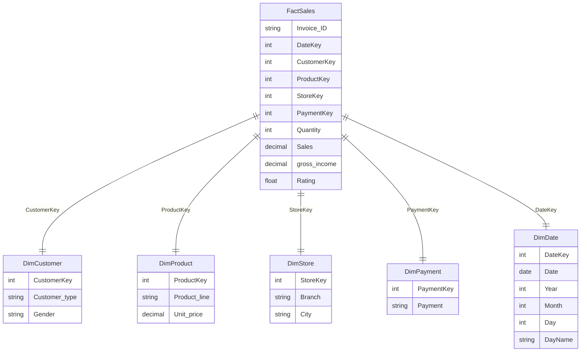

# Retail Sales Data Warehouse & ETL Pipeline

End-to-end **Data Engineering project** demonstrating:

- Python ETL pipeline
- Data cleaning & transformation
- Dimensional modeling (Star Schema)
- SQL Data Warehouse design
- Query optimization with indexes
- Reporting layer for BI tools

---

## Project Architecture



---

## Dataset

This project uses the [Supermarket Sales dataset](https://www.kaggle.com/datasets/aungpyaeap/supermarket-sales), which contains transactional retail data including:

- Customer information
- Product categories
- Store locations
- Payment methods
- Sales metrics

Each row represents a single sales transaction.

---

## ETL Pipeline

The ETL pipeline was implemented using Python and Pandas.

### Extract

Load dataset from CSV:

```python
import pandas as pd

df = pd.read_csv("data/supermarket_sales.csv")
```

### Exploratory Data Analysis

Basic inspection of the dataset:

```python
df.info()
df.describe()
df.head()
```

### Data Cleaning

Cleaning steps included:

- Standardizing column names
- Handling missing values
- Converting data types
- Removing duplicates

Example:

```python
df.columns = df.columns.str.lower().str.replace(" ", "_")
```

### Transformation

Data was transformed into a Star Schema suitable for analytical workloads.

Created tables:

- `DimCustomer`
- `DimProduct`
- `DimStore`
- `DimPayment`
- `DimDate`
- `FactSales`

---

## Data Warehouse Model



---

## SQL Warehouse Implementation

Example table creation:

```sql
CREATE TABLE FactSales (
    Invoice_ID   VARCHAR(20),
    DateKey      INT,
    CustomerKey  INT,
    ProductKey   INT,
    StoreKey     INT,
    PaymentKey   INT,
    Quantity     INT,
    Sales        DECIMAL(10,2),
    gross_income DECIMAL(10,2),
    Rating       FLOAT
)
```

---

## Incremental Load Logic

To prevent duplicate records, a simple incremental loading strategy was implemented.

Steps:

1. Retrieve existing `Invoice_ID` values from the warehouse
2. Compare with incoming dataset
3. Insert only new transactions

Example logic:

```python
existing_ids = pd.read_sql("SELECT Invoice_ID FROM FactSales", connection)

new_data = df[~df["invoice_id"].isin(existing_ids["Invoice_ID"])]
```

---

## SQL Performance Optimization

Indexes were created to improve query performance:

```sql
CREATE INDEX IX_FactSales_DateKey
ON FactSales(DateKey);

CREATE INDEX IX_FactSales_ProductKey
ON FactSales(ProductKey);
```

---

## Reporting View

A reporting view was created for BI tools:

```sql
CREATE VIEW vw_SalesAnalysis AS
SELECT
    d.Year,
    d.Month,
    p.Product_line,
    s.City,
    SUM(f.Sales)    AS Revenue,
    SUM(f.Quantity) AS Quantity
FROM FactSales f
JOIN DimDate    d ON f.DateKey    = d.DateKey
JOIN DimProduct p ON f.ProductKey = p.ProductKey
JOIN DimStore   s ON f.StoreKey   = s.StoreKey
GROUP BY
    d.Year,
    d.Month,
    p.Product_line,
    s.City
```

---

## Technologies Used

| Category | Tools |
|---|---|
| Language | Python |
| Libraries | Pandas, NumPy |
| Database | SQL Server |
| Connectors | pyodbc, SQLAlchemy |
| Modeling | Dimensional Modeling / Star Schema |
| Version Control | Git & GitHub |

---

## Repository Structure

```
retail-sales-etl-pipeline/
│
├── data/
│   └── supermarket_sales.csv
│
├── notebooks/
│   └── retail_sales_etl.ipynb
│
├── sql/
│   ├── create_tables.sql
│   ├── indexes.sql
│   └── views.sql
│
└── README.md
```

---

## ETL Notebook

The full pipeline implementation can be found in:

```
notebooks/retail_sales_etl.ipynb
```

---

## Skills Demonstrated

- Data Engineering
- ETL Development
- Data Cleaning & Transformation
- Data Warehousing
- Star Schema Modeling
- SQL Optimization
- BI Data Modeling

---

## Future Improvements

- Airflow pipeline orchestration
- Automated incremental loads
- Dockerized pipeline
- Cloud warehouse deployment
- Power BI dashboard

---

## Author

Data Engineering Portfolio Project
